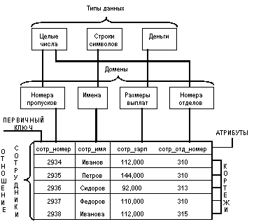

# Реляционная модель данных

## Базовые понятия

Реляционная модель данных - разработанная Э.Коддом в 1970г. логическая
модель данных, описывающая:

-   структуры данных в виде (изменяющихся во времени) наборов отношений;
-   теоретико-множественные операции над данными: объединение,
    пересечение, разность и декартово произведение;
-   специальные реляционные операции: селекция, проекция, соединение и
    деление; а также
-   специальные правила, обеспечивающие целостность данных.

Основными понятиями реляционных баз данных являются *тип данных, домен,
атрибут, кортеж, первичный ключ и отношение*.

Покажем смысл этих понятий на примере отношения СОТРУДНИКИ, содержащего
информацию о сотрудниках некоторой организации:

### Тип данных

Понятие тип данных в реляционной модели данных полностью адекватно
понятию типа данных в языках программирования. Обычно в современных
реляционных БД допускается хранение символьных, числовых данных, битовых
строк, специализированных числовых данных (таких как «деньги»), а также
специальных «темпоральных» данных (дата, время, временной интервал).
Активно развивается подход к расширению возможностей реляционных систем
абстрактными типами данных (соответствующими возможностями обладают,
например, системы семейства Postgres). В нашем примере мы имеем дело с
данными трех типов: строки символов, целые числа и «деньги».

### Домен

Понятие домена более специфично для баз данных, хотя и имеет некоторые
аналогии с подтипами в некоторых языках программирования. В самом общем
виде домен определяется заданием некоторого базового типа данных, к
которому относятся элементы домена, и произвольного логического
выражения, применяемого к элементу типа данных. Если вычисление этого
логического выражения дает результат «истина», то элемент данных
является элементом домена.

Наиболее правильной интуитивной трактовкой понятия домена является
понимание домена как допустимого потенциального множества значений
данного типа. Например, домен «Имена» в нашем примере определен на
базовом типе строк символов, но в число его значений могут входить
только те строки, которые могут изображать имя (в частности, такие
строки не могут начинаться с мягкого знака).

Следует отметить также семантическую нагрузку понятия домена: данные
считаются сравнимыми только в том случае, когда они относятся к одному
домену. В нашем примере значения доменов «Номера пропусков» и «Номера
групп» относятся к типу целых чисел, но не являются сравнимыми.

### Атрибут

Атрибут - в базах данных - имя или структура поля записи. Атрибут
характеризует размер или тип информации, содержащейся в поле.

### Запись

Запись - в реляционных базах данных - строка таблицы данных, состоящая
из полей разного типа.

### Первичный ключ

Ключ отношения - атрибут отношения, однозначно идентифицирующий каждый
из его кортежей. Составной ключ состоит из нескольких атрибутов.

### Отношение

Отношение - двумерная таблица, содержащую некоторые данные. Строки таких
таблиц соответствуют записям, а столбцы - атрибутам.

### Реляционная алгебра

Реляционная алгебра - формальная система манипулирования отношениями,
основными операциями которой являются: проекция, соединение, пересечение
и объединение.

### Фундаментальные свойства отношений

Рассмотрим некоторые важные свойства отношений:

1.  Отсутствие кортежей-дубликатов То свойство, что отношения не
    содержат кортежей-дубликатов, следует из определения отношения как
    множества кортежей. В классической теории множеств по определению
    каждое множество состоит из различных элементов. Из этого свойства
    вытекает наличие у каждого отношения так называемого первичного
    ключа - набора атрибутов, значения которых однозначно определяют
    кортеж отношения. Для каждого отношения по крайней мере полный набор
    его атрибутов обладает этим свойством. Однако при формальном
    определении первичного ключа требуется обеспечение его
    «минимальности», т.е. в набор атрибутов первичного ключа не должны
    входить такие атрибуты, которые можно отбросить без ущерба для
    основного свойства - однозначно определять кортеж. Понятие
    первичного ключа является исключительно важным в связи с понятием
    целостности баз данных. Забегая вперед, заметим, что во многих
    практических реализациях РСУБД допускается нарушение свойства
    уникальности кортежей для промежуточных отношений, порождаемых
    неявно при выполнении запросов. Такие отношения являются не
    множествами, а мультимножествами, что в ряде случаев позволяет
    добиться определенных преимуществ, но иногда приводит к серьезным
    проблемам.
2.  Отсутствие упорядоченности кортежей Свойство отсутствия
    упорядоченности кортежей отношения также является следствием
    определения отношения-экземпляра как множества кортежей. Отсутствие
    требования к поддержанию порядка на множестве кортежей отношения
    дает дополнительную гибкость СУБД при хранении баз данных во внешней
    памяти и при выполнении запросов к базе данных. Это не противоречит
    тому, что при формулировании запроса к БД, например, на языке SQL
    можно потребовать сортировки результирующей таблицы в соответствии
    со значениями некоторых столбцов. Такой результат, вообще говоря, не
    отношение, а некоторый упорядоченный список кортежей.
3.  Отсутствие упорядоченности атрибутов Атрибуты отношений не
    упорядочены. Для ссылки на значение атрибута в кортеже отношения
    всегда используется имя атрибута. Это свойство теоретически
    позволяет, например, модифицировать схемы существующих отношений не
    только путем добавления новых атрибутов, но и путем удаления
    существующих атрибутов. Однако в большинстве существующих систем
    такая возможность не допускается, и хотя упорядоченность набора
    атрибутов отношения явно не требуется, часто в качестве неявного
    порядка атрибутов используется их порядок в линейной форме
    определения схемы отношения.
4.  Атомарность значений атрибутов Значения всех атрибутов являются
    атомарными. Это следует из определения домена как потенциального
    множества значений простого типа данных, т.е. среди значений домена
    не могут содержаться множества значений (отношения). Принято
    говорить, что в реляционных базах данных допускаются только
    нормализованные отношения или отношения, представленные в первой
    нормальной форме.

### Целостность сущности и ссылок

Наконец, в целостной части реляционной модели данных фиксируются два
базовых требования целостности, которые должны поддерживаться в любой
реляционной СУБД. Первое требование называется требованием целостности
сущностей. Объекту или сущности реального мира в реляционных БД
соответствуют кортежи отношений. Конкретно требование состоит в том, что
любой кортеж любого отношения отличим от любого другого кортежа этого
отношения, т.е. другими словами, любое отношение должно обладать
первичным ключом. Как мы видели в предыдущем разделе, это требование
автоматически удовлетворяется, если в системе не нарушаются базовые
свойства отношений.

Второе требование называется требованием целостности по ссылкам и
является несколько более сложным. Очевидно, что при соблюдении
нормализованности отношений сложные сущности реального мира
представляются в реляционной БД в виде нескольких кортежей нескольких
отношений. Например, представим, что нам требуется представить в
реляционной базе данных сущность ОТДЕЛ с атрибутами ОТД_НОМЕР (номер
отдела), ОТД_КОЛ (количество сотрудников) и ОТД_СОТР (набор сотрудников
отдела). Для каждого сотрудника нужно хранить СОТР_НОМЕР (номер
сотрудника), СОТР_ИМЯ (имя сотрудника) и СОТР_ЗАРП (заработная плата
сотрудника). При правильном проектировании соответствующей БД в ней
появятся два отношения: ОТДЕЛЫ ( ОТД_НОМЕР, ОТД_КОЛ ) (первичный ключ
-ОТД_НОМЕР) и СОТРУДНИКИ (СОТР_НОМЕР, СОТР_ИМЯ, СОТР_ЗАРП, СОТР_ОТД_НОМ
) (первичный ключ - СОТР_НОМЕР).

Как видно, атрибут СОТР_ОТД_НОМ появляется в отношении СОТРУДНИКИ не
потому, что номер отдела является собственным свойством сотрудника, а
лишь для того, чтобы иметь возможность восстановить при необходимости
полную сущность ОТДЕЛ. Значение атрибута СОТР_ОТД_НОМ в любом кортеже
отношения СОТРУДНИКИ должно соответствовать значению атрибута ОТД_НОМ в
некотором кортеже отношения ОТДЕЛЫ. Атрибут такого рода называется
внешним ключом, поскольку его значения однозначно характеризуют
сущности, представленные кортежами некоторого другого отношения (т.е.
задают значения их первичного ключа). Говорят, что отношение, в котором
определен внешний ключ, ссылается на соответствующее отношение, в
котором такой же атрибут является первичным ключом.

Требование целостности по ссылкам, или требование внешнего ключа состоит
в том, что для каждого значения внешнего ключа, появляющегося в
ссылающемся отношении, в отношении, на которое ведет ссылка, должен
найтись кортеж с таким же значением первичного ключа, либо значение
внешнего ключа должно быть неопределенным (т.е. ни на что не указывать).
Для нашего примера это означает, что если для сотрудника указан номер
отдела, то этот отдел должен существовать.

Ограничения целостности сущности и по ссылкам должны поддерживаться
СУБД. Для соблюдения целостности сущности достаточно гарантировать
отсутствие в любом отношении кортежей с одним и тем же значением
первичного ключа. С целостностью по ссылкам дела обстоят несколько более
сложно.

Понятно, что при обновлении ссылающегося отношения (вставке новых
кортежей или модификации значения внешнего ключа в существующих
кортежах) достаточно следить за тем, чтобы не появлялись некорректные
значения внешнего ключа. Но как быть при удалении кортежа из отношения,
на которое ведет ссылка? Здесь существуют три подхода, каждый из которых
поддерживает целостность по ссылкам. Первый подход заключается в том,
что запрещается производить удаление кортежа, на который существуют
ссылки (т.е. сначала нужно либо удалить ссылающиеся кортежи, либо
соответствующим образом изменить значения их внешнего ключа). При втором
подходе при удалении кортежа, на который имеются ссылки, во всех
ссылающихся кортежах значение внешнего ключа автоматически становится
неопределенным. Наконец, третий подход (каскадное удаление) состоит в
том, что при удалении кортежа из отношения, на которое ведет ссылка, из
ссылающегося отношения автоматически удаляются все ссылающиеся кортежи.

В развитых реляционных СУБД обычно можно выбрать способ поддержания
целостности по ссылкам для каждой отдельной ситуации определения
внешнего ключа. Для принятия такого решения необходимо анализировать
требования конкретной прикладной области.

Преимущества реляционного подхода достаточно очевидны:

1.  Предсказуемость результатов работы с данными. В основе реляционной
    модели лежит математическая модель, следовательно, любой запрос к
    базе данных, составленный на корректном языке влечет ответ,
    однозначно определяемый схемой БД и конкретными данными. При этом
    пользователю не требуется информация о физической организации
    данных.
2.  Предметная область часто достаточно естественно описывается в
    терминах таблиц (к сожалению, в реляционной модели имеются проблемы
    с представлением иерархических структур).

По этим причинам идея создания реляционной СУБД стала популярна среди
разработчиков вскоре после ее появления. Сейчас существует множество
коммерческих и некоммерческих систем, создатели которых заявляют об их
«реляционности». Для того, чтобы более определенно сформулировать цель,
к которой разработчикам нужно стремится, Е.Кодд в конце 70-х годов
опубликовал 12 правил соответствия реляционной модели, которые опираются
на основное (подразумеваемое) правило:

> Система, которая провозглашается поставщиком как реляционная СУБД,
> должна управлять базами данных исключительно способами,
> соответствующими реляционной модели.

Конкретные требования к реляционной СУБД раскрываются в следующих
правилах:

1.  Информационное правило. Вся информация, хранимая в базе данных,
    должна быть представлена единственным образом: в виде значений в
    реляционных таблицах.
2.  Правило гарантированного логического доступа. К каждому имеющемуся в
    реляционной базе атомарному значению должен быть гарантирован доступ
    с помощью указания имени таблицы, значения первичного ключа и имени
    атрибута.
3.  Правило наличия значения (missing information). В полностью
    реляционной СУБД должны иметься специальные индикаторы (отличные от
    пустой символьной строки или строки из одних пробелов и отличные от
    нуля или какого-то другого числового значения) для выражения (на
    логическом уровне, не зависимо от типа данных) того факта, что
    значение отсутствует по меньшей мере по двум различным причинам: его
    действительно нет, либо оно не применимо к данной позиции. СУБД
    должна не только отражать этот факт, но и распространять на такие
    индикаторы свои функции манипулирования данными не зависимо от типа
    данных. Как правило это значение обозначается null.
4.  Правило динамического диалогового реляционного каталога. Описание
    базы данных выглядит логически как обычные данные, так что
    авторизованные пользователи и прикладные программы могут употреблять
    для работы с этим описанием тот же реляционный язык, что и при
    работе с обычными данными.
5.  Правило полноты языка работы с данными. Сколько бы много в СУБД ни
    поддерживалось языков и режимов работы с данными, должен иметься по
    крайней мере один язык, выразимый в виде командных строк в некотором
    удобном синтаксисе, который бы позволял формулировать:
    1.  определение данных;
    2.  определение правил целостности;
    3.  манипулирование данными (в диалоге и из программы);
    4.  определение таблиц-представлений (в том числе и возможности их
        модификации);
    5.  определение правил авторизации;
    6.  границы транзакций.
6.  Правило модификации таблиц-представлений. В СУБД должен существовать
    корректный алгоритм, позволяющий автоматически для каждой
    таблицы-представления определять во время ее создания, может ли она
    использоваться для вставки и удаления строк и какие из столбцов
    допускают модификацию, и заносящий полученную таким образом
    информацию в системный каталог.
7.  Правило множественности операций. Возможность оперирования базовыми
    таблицами или таблицами-представлениями распространяется полностью
    не только на выдачу информации из БД, но и на вставку, модификацию и
    удаление данных.
8.  Правило физической независимости. Диалоговые операторы и прикладные
    программы на логическом уровне не должны страдать от каких-либо
    изменений во внутреннем хранении данных или методах доступа СУБД
9.  Правило логической независимости. Диалоговые операторы и прикладные
    программы на логическом уровне не должны страдать от таких изменений
    в базовых таблицах, которые сохраняют информацию и теоретически
    допускают неизменность этих операторов и программ.
10. Правило сохранения целостности. Диалоговые операторы и прикладные
    программы не должны изменяться при изменении правил целостности в
    БД, задаваемых языком работы с данными и хранимых в системном
    каталоге.
11. Правило независимости от распределенности. Диалоговые операторы и
    прикладные программы на логическом уровне не должны зависеть от
    совершаемого физического разнесения данных (если первоначально СУБД
    работала с нераспределенными данными) или перераспределения (если
    СУБД распределенная).
12. Правило ненарушения реляционного языка. Если в реляционной СУБД
    имеется язык низкого уровня (для работы с отдельными строками), он
    не должен позволять нарушать или «обходить» правила,
    сформулированные на языке высокого уровня (множественном) и
    занесенные в системный каталог.
