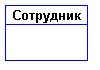
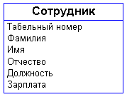
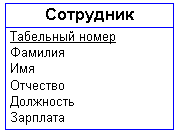
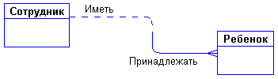
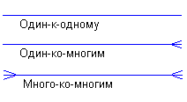
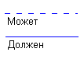

# Модель "Сущность-Связь"

В реальном проектировании структуры базы данных широко применяется
*семантическое моделирование*. Семантическое моделирование представляет
собой моделирование структуры данных, опираясь на смысл этих данных. В
качестве инструмента семантического моделирования используются различные
варианты диаграмм сущность-связь (ER - Entity-Relationship).

Первый вариант модели сущность-связь был предложен в 1976 г. Питером
Пин-Шэн Ченом. В дальнейшем многими авторами были разработаны свои
варианты подобных моделей (нотация Мартина, нотация IDEF1X, нотация
Баркера и др.). Кроме того, различные программные средства, реализующие
одну и ту же нотацию, могут отличаться своими возможностями. По сути,
все варианты диаграмм сущность-связь исходят из одной идеи - рисунок
всегда нагляднее текстового описания. Все такие диаграммы используют
графическое изображение сущностей предметной области, их свойств
(атрибутов), и взаимосвязей между сущностями.

Мы опишем работу с ER-диаграммами близко к нотации Баркера, как довольно
легкой в понимании основных идей. Данная глава является скорее
иллюстрацией методов семантического моделирования, чем полноценным
введением в эту область.

## Сущность

Сущность - это класс однотипных объектов, информация о которых должна
быть учтена в модели. Каждая сущность должна иметь наименование,
выраженное существительным в единственном числе. Примерами сущностей
могут быть такие классы объектов как "Поставщик", "Сотрудник",
"Накладная".

Каждая сущность в модели изображается в виде прямоугольника с
наименованием:

## Экземпляр сущности

Экземпляр сущности - это конкретный представитель данной сущности.
Например, представителем сущности "Сотрудник" может быть "Сотрудник
Иванов". Экземпляры сущностей должны быть различимы, т.е. сущности
должны иметь некоторые свойства, уникальные для каждого экземпляра этой
сущности.

## Атрибут сущности

Атрибут сущности - это именованная характеристика, являющаяся некоторым
свойством сущности. Наименование атрибута должно быть выражено
существительным в единственном числе (возможно, с характеризующими
прилагательными). Примерами атрибутов сущности "Сотрудник" могут быть
такие атрибуты как "Табельный номер", "Фамилия", "Имя", "Отчество",
"Должность", "Зарплата" и т.п.

Атрибуты изображаются в пределах прямоугольника, определяющего сущность:

## Ключ сущности

Ключ сущности - это неизбыточный набор атрибутов, значения которых в
совокупности являются уникальными для каждого экземпляра сущности.
Неизбыточность заключается в том, что удаление любого атрибута из ключа
нарушается его уникальность. Сущность может иметь несколько различных
ключей.

Ключевые атрибуты изображаются на диаграмме подчеркиванием:

## Связь

Связь - это некоторая ассоциация между двумя сущностями. Одна сущность
может быть связана с другой сущностью или сама с собою. Связи позволяют
по одной сущности находить другие сущности, связанные с нею. Например,
связи между сущностями могут выражаться следующими фразами - "СОТРУДНИК
может иметь несколько ДЕТЕЙ", "каждый СОТРУДНИК обязан числиться ровно в
одном ОТДЕЛЕ".

Графически связь изображается линией, соединяющей две сущности:

Каждая связь имеет два конца и одно или два наименования. Наименование
обычно выражается в неопределенной глагольной форме: "иметь",
"принадлежать" и т.п. Каждое из наименований относится к своему концу
связи. Иногда наименования не пишутся ввиду их очевидности.

Каждая связь может иметь один из следующих типов связи:

Связь типа один-к-одному означает, что один экземпляр первой сущности
(левой) связан с одним экземпляром второй сущности (правой). Связь
один-к-одному чаще всего свидетельствует о том, что на самом деле мы
имеем всего одну сущность, неправильно разделенную на две.

Связь типа один-ко-многим означает, что один экземпляр первой сущности
(левой) связан с несколькими экземплярами второй сущности (правой). Это
наиболее часто используемый тип связи. Левая сущность (со стороны
"один") называется родительской, правая (со стороны "много") - дочерней.

Связь типа много-ко-многим означает, что каждый экземпляр первой
сущности может быть связан с несколькими экземплярами второй сущности, и
каждый экземпляр второй сущности может быть связан с несколькими
экземплярами первой сущности. Тип связи много-ко-многим является
временным типом связи, допустимым на ранних этапах разработки модели. В
дальнейшем этот тип связи должен быть заменен двумя связями типа
один-ко-многим путем создания промежуточной сущности.

Каждая связь может иметь одну из двух модальностей связи:

Модальность "может" означает, что экземпляр одной сущности может быть
связан с одним или несколькими экземплярами другой сущности, а может
быть и не связан ни с одним экземпляром.

Модальность "должен" означает, что экземпляр одной сущности обязан быть
связан не менее чем с одним экземпляром другой сущности.

Связь может иметь разную модальность с разных концов.

Описанный графический синтаксис позволяет однозначно читать диаграммы,
пользуясь следующей схемой построения фраз:

*\<Каждый экземпляр СУЩНОСТИ 1\> \<экземпляр СУЩНОСТИ 2\>*

Каждая связь может быть прочитана как слева направо, так и справа
налево. Связь на рисунке читается так:

-   Слева направо: "каждый сотрудник может иметь несколько детей".
-   Справа налево: "Каждый ребенок обязан принадлежать ровно одному
    сотруднику".
