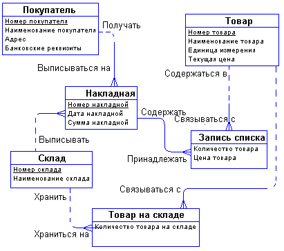
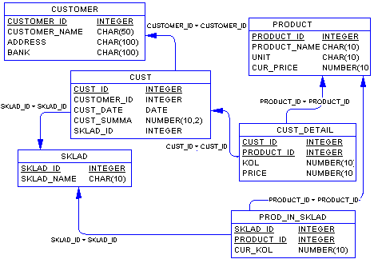

# Пример разработки ER-модели

При разработке ER-моделей мы должны получить следующую информацию о предметной области:

1. Список сущностей предметной области. 
1. Список атрибутов сущностей. 
1. Описание взаимосвязей между сущностями. 

ER-диаграммы удобны тем, что процесс выделения сущностей, атрибутов и связей является итерационным. Разработав первый приближенный вариант диаграмм, мы уточняем их, опрашивая экспертов предметной области. При этом документацией, в которой фиксируются результаты бесед, являются сами ER-диаграммы. 

Предположим, что перед нами стоит задача разработать информационную систему по заказу некоторой оптовой торговой фирмы. В первую очередь мы должны изучить предметную область и процессы, происходящие в ней. Для этого мы опрашиваем сотрудников фирмы, читаем документацию, изучаем формы заказов, накладных и т.п. 

Например, в ходе беседы с менеджером по продажам, выяснилось, что он (менеджер) считает, что проектируемая система должна выполнять следующие действия: 

1. Хранить информацию о покупателях. 
1. Печатать накладные на отпущенные товары. 
1. Следить за наличием товаров на складе.

Выделим все существительные в этих предложениях - это будут потенциальные кандидаты на сущности и атрибуты, и проанализируем их (непонятные термины будем выделять знаком вопроса):

1. Покупатель - явный кандидат на сущность. 
1. Накладная - явный кандидат на сущность. 
1. Товар - явный кандидат на сущность 
1. (?)Склад - а вообще, сколько складов имеет фирма? Если несколько, то это будет кандидатом на новую сущность. 
1. (?)Наличие товара - это, скорее всего, атрибут, но атрибут какой сущности? 

Сразу возникает очевидная связь между сущностями - "покупатели могут покупать много товаров" и "товары могут продаваться многим покупателям". Первый вариант диаграммы выглядит так:

Задав дополнительные вопросы менеджеру, мы выяснили, что фирма имеет несколько складов. Причем, каждый товар может храниться на нескольких складах и быть проданным с любого склада.

Куда поместить сущности "Накладная" и "Склад" и с чем их связать? Спросим себя, как связаны эти сущности между собой и с сущностями "Покупатель" и "Товар"? Покупатели покупают товары, получая при этом накладные, в которые внесены данные о количестве и цене купленного товара. Каждый покупатель может получить несколько накладных. Каждая накладная обязана выписываться на одного покупателя. Каждая накладная обязана содержать несколько товаров (не бывает пустых накладных). Каждый товар, в свою очередь, может быть продан нескольким покупателям через несколько накладных. Кроме того, каждая накладная должна быть выписана с определенного склада, и с любого склада может быть выписано много накладных. Таким образом, после уточнения, диаграмма будет выглядеть следующим образом:

Пора подумать об атрибутах сущностей. Беседуя с сотрудниками фирмы, мы выяснили следующее:

1. Каждый покупатель является юридическим лицом и имеет наименование, адрес, банковские реквизиты. 
1. Каждый товар имеет наименование, цену, а также характеризуется единицами измерения. 
1. Каждая накладная имеет уникальный номер, дату выписки, список товаров с количествами и ценами, а также общую сумму накладной. Накладная выписывается с определенного склада и на определенного покупателя. 
1. Каждый склад имеет свое наименование. 
1. Снова выпишем все существительные, которые будут потенциальными атрибутами, и проанализируем их: 
1. Юридическое лицо - термин риторический, мы не работаем с физическими лицами. Не обращаем внимания. 
1. Наименование покупателя - явная характеристика покупателя. 
1. Адрес - явная характеристика покупателя. 
1. Банковские реквизиты - явная характеристика покупателя. 
1. Наименование товара - явная характеристика товара. 
1. (?)Цена товара - похоже, что это характеристика товара. Отличается ли эта характеристика от цены в накладной? 
1. Единица измерения - явная характеристика товара. 
1. Номер накладной - явная уникальная характеристика накладной. 
1. Дата накладной - явная характеристика накладной. 
1. (?)Список товаров в накладной - список не может быть атрибутом. Вероятно, нужно выделить этот список в отдельную сущность. 
1. (?)Количество товара в накладной - это явная характеристика, но характеристика чего? Это характеристика не просто "товара", а "товара в накладной". 
1. (?)Цена товара в накладной - опять же это должна быть не просто характеристика товара, а характеристика товара в накладной. Но цена товара уже встречалась выше - это одно и то же? 
1. Сумма накладной - явная характеристика накладной. Эта характеристика не является независимой. Сумма накладной равна сумме стоимостей всех товаров, входящих в накладную. 
1. Наименование склада - явная характеристика склада. 

В ходе дополнительной беседы с менеджером удалось прояснить различные понятия цен. Оказалось, что каждый товар имеет некоторую текущую цену. Эта цена, по которой товар продается в данный момент. Естественно, что эта цена может меняться со временем. Цена одного и того же товара в разных накладных, выписанных в разное время, может быть различной. Таким образом, имеется две цены - цена товара в накладной и текущая цена товара.

С возникающим понятием "Список товаров в накладной" все довольно ясно. Сущности "Накладная" и "Товар" связаны друг с другом отношением типа много-ко-многим. Такая связь, как мы отмечали ранее, должна быть расщеплена на две связи типа один-ко-многим. Для этого требуется дополнительная сущность. Этой сущностью и будет сущность "Список товаров в накладной". Связь ее с сущностями "Накладная" и "Товар" характеризуется следующими фразами - "каждая накладная обязана иметь несколько записей из списка товаров в накладной", "каждая запись из списка товаров в накладной обязана включаться ровно в одну накладную", "каждый товар может включаться в несколько записей из списка товаров в накладной", " каждая запись из списка товаров в накладной обязана быть связана ровно с одним товаром". Атрибуты "Количество товара в накладной" и "Цена товара в накладной" являются атрибутами сущности " Список товаров в накладной".

Точно также поступим со связью, соединяющей сущности "Склад" и "Товар". Введем дополнительную сущность "Товар на складе". Атрибутом этой сущности будет "Количество товара на складе". Таким образом, товар будет числиться на любом складе и количество его на каждом складе будет свое.

Теперь можно внести все это в диаграмму:

## Концептуальные и физические ER-модели

Разработанный выше пример ER-диаграммы является примером концептуальной диаграммы. Это означает, что диаграмма не учитывает особенности конкретной СУБД. По данной концептуальной диаграмме можно построить физическую диаграмму, которая уже будут учитываться такие особенности СУБД, как допустимые типы и наименования полей и таблиц, ограничения целостности и т.п. Физический вариант диаграммы может выглядеть, например, следующим образом:

На данной диаграмме каждая сущность представляет собой таблицу базы данных, каждый атрибут становится колонкой соответствующей таблицы. Обращаем внимание на то, что во многих таблицах, например, "CUST_DETAIL" и "PROD_IN_SKLAD", соответствующих сущностям "Запись списка накладной" и "Товар на складе", появились новые атрибуты, которых не было в концептуальной модели - это ключевые атрибуты родительских таблиц, мигрировавших в дочерние таблицы для того, чтобы обеспечить связь между таблицами посредством внешних ключей.

