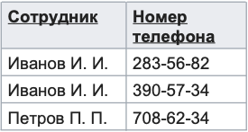
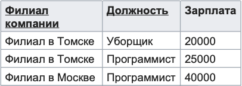
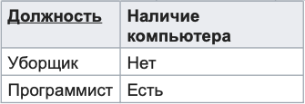
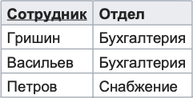
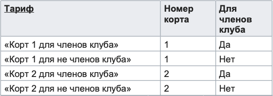

# Теория нормальных форм

Нормальная форма --- свойство отношения в реляционной модели данных,
характеризующее его с точки зрения избыточности, потенциально приводящей
к логически ошибочным результатам выборки или изменения данных.
Нормальная форма определяется как совокупность требований, которым
должно удовлетворять отношение.

Процесс преобразования отношений базы данных к виду, отвечающему
нормальным формам, называется нормализацией. Нормализация предназначена
для приведения структуры БД к виду, обеспечивающему минимальную
логическую избыточность, и не имеет целью уменьшение или увеличение
производительности работы или же уменьшение или увеличение физического
объёма базы данных. Конечной целью нормализации является уменьшение
потенциальной противоречивости хранимой в базе данных информации. Общее
назначение процесса нормализации заключается в следующем:

1.  исключение некоторых типов избыточности;
2.  устранение некоторых аномалий обновления;
3.  разработка проекта базы данных, который является достаточно
    «качественным» представлением реального мира, интуитивно понятен и
    может служить хорошей основой для последующего расширения;
4.  упрощение процедуры применения необходимых ограничений целостности.

Устранение избыточности производится, как правило, за
счёт декомпозиции отношений таким образом, чтобы в каждом отношении
хранились только первичные факты (то есть факты, не выводимые из других
хранимых фактов).

При том, что идеи нормализации весьма полезны для проектирования баз
данных, они отнюдь не являются универсальным или исчерпывающим средством
повышения качества проекта БД. Это связано с тем, что существует слишком
большое разнообразие возможных ошибок и недостатков в структуре БД,
которые нормализацией не устраняются. Несмотря на эти рассуждения,
теория нормализации является очень ценным достижением реляционной теории
и практики, поскольку она даёт научно строгие и обоснованные критерии
качества проекта БД и формальные методы для усовершенствования этого
качества. Этим теория нормализации резко выделяется на фоне
чисто эмпирических подходов к проектированию, которые предлагаются в
других моделях данных. Более того, можно утверждать, что во всей
сфере информационных технологий практически отсутствуют методы оценки и
улучшения проектных решений, сопоставимые с теорией нормализации
реляционных баз данных по уровню формальной строгости.

## Первая нормальная форма (1НФ)

Отношение находится в первой нормальной форме тогда и только тогда,
когда в любом допустимом значении этой переменной
каждый кортеж отношения содержит только одно значение для каждого из
атрибутов.

В реляционной модели отношение всегда находится в первой нормальной
форме по определению понятия отношение.

Что же касается различных таблиц, то они могут не быть правильными
представлениями отношений и, соответственно, могут не находиться в 1НФ.
В соответствии с определением Кристофера Дейта для такого случая таблица
нормализована (эквивалентно --- находится в первой нормальной форме)
тогда и только тогда, когда она является прямым и верным представлением
некоторого отношения. Конкретнее, рассматриваемая таблица должна
удовлетворять следующим пяти условиям:

1.  Нет упорядочивания строк сверху вниз (другими словами, порядок строк
    не несет в себе никакой информации).
2.  Нет упорядочивания столбцов слева направо (другими словами, порядок
    столбцов не несет в себе никакой информации).
3.  Нет повторяющихся строк.
4.  Каждое пересечение строки и столбца содержит ровно одно значение из
    соответствующего домена (и больше ничего).
5.  Все столбцы являются обычными.

«Обычность» всех столбцов таблицы означает, что в таблице нет «скрытых»
компонентов, которые могут быть доступны только в вызове некоторого
специального оператора взамен ссылок на имена регулярных столбцов, или
которые приводят к побочным эффектам для строк или таблиц при вызове
стандартных операторов. Таким образом, например, строки не имеют
идентификаторов кроме обычных значений потенциальных ключей (без скрытых
«идентификаторов строк» или «идентификаторов объектов»). Они также не
имеют скрытых временных меток.

### Пример

Исходная ненормализованная (то есть не являющаяся правильным
представлением некоторого отношения) таблица:

Таблица, приведённая к 1НФ, являющаяся правильным представлением
некоторого отношения:

### Атомарность

Многие авторы дополняют определение первой нормальной формы
требованием атомарности (неделимости) значений. Однако концепция
«атомарности» является слишком неясной. Например, многие типы данных
(строки, даты, числа с фиксированной точкой и т. д.) при необходимости
легко могут быть декомпозированы на составляющие элементы с помощью
стандартных операций, предоставляемых СУБД. К. Дейт заключает, что
«понятие атомарности не имеет абсолютно никакого смысла».

Исторически концепция «атомарности» берёт начало от «простых доменов»
(англ. simple domains), предложенных автором реляционной модели
данных Э. Ф. Коддом. Цель «нормальной формы», которую предложил Кодд в
статье «Реляционная модель данных для больших совместно используемых
банков данных», не была связана с каким-либо теоретическим аспектом,
например, с борьбой с аномалиями или избыточностью. Кодд предложил
использовать «простые домены» только для облегчения будущей программной
реализации, а именно:

1.  для облегчения хранения отношений в виде двумерных массивов.
    Отношение, все домены которого являются простыми, может быть
    представлено при хранении двухмерным массивом с однородными
    столбцами.
2.  для облегчения передачи данных в гетерогенных системах. Простота
    представления отношений массивами, осуществимая в случае приведения
    всех отношений в нормальную форму, предоставляет преимущества не
    только при хранении, но также при передаче больших объёмов данных
    между системами, использующими во многом отличные представления
    данных.

## Вторая нормальная форма (2НФ)

Отношение находится во второй нормальной форме тогда и только тогда,
когда она находится в первой нормальной форме и каждый неключевой
атрибут неприводимо зависит от (каждого) её потенциального ключа.

Неприводимость означает, что в составе потенциального ключа отсутствует
меньшее подмножество атрибутов, от которого можно также вывести
данную функциональную зависимость. Для неприводимой функциональной
зависимости часто используется эквивалентное понятие «полная
функциональная зависимость».

Если потенциальный ключ является простым, то есть состоит из
единственного атрибута, то любая функциональная зависимость от него
является неприводимой (полной). Если потенциальный ключ является
составным, то, согласно определению второй нормальной формы, в отношении
не должно быть неключевых атрибутов, зависящих от части составного
потенциального ключа.

Вторая нормальная форма по определению запрещает наличие неключевых
атрибутов, которые вообще не зависят от потенциального ключа. Таким
образом, вторая нормальная форма в том числе запрещает создавать
отношения как несвязанные (хаотические, случайные) наборы атрибутов.

### Пример

Пусть в следующем отношении первичный ключ образует пара атрибутов
{Филиал компании, Должность}:

Допустим, что зарплата зависит от филиала и должности, а наличие
компьютера зависит только от должности.

Существует функциональная зависимость Должность → Наличие компьютера, в
которой левая часть (детерминант) является лишь частью первичного ключа,
что нарушает условие второй нормальной формы.

Для приведения к 2NF исходное отношение следует декомпозировать на два
отношения:

## Третья нормальная форма (3НФ)

Отношение R находится в 3NF тогда и только тогда, когда выполняются
следующие условия:

1.  R находится во второй нормальной форме.
2.  ни один неключевой атрибут R не находится в
    транзитивной функциональной зависимости от потенциального ключа R.

Пояснения к определению:

*Неключевой атрибут* отношения R --- это атрибут, который не принадлежит
ни одному из потенциальных ключей R.

*Функциональная зависимость* множества атрибутов Z от множества
атрибутов X (записывается X → Z, произносится «икс определяет зет»)
является транзитивной, если существует такое множество атрибутов Y,
что X → Y и Y → Z. При этом ни одно из множеств X, Y и Z не является
подмножеством другого, то есть функциональные
зависимости X → Z, X → Y и Y → Z не являются \*тривиальными\*, а также
отсутствует функциональная зависимость Y → X.

Определение 3NF, эквивалентное определению Кодда, но по-другому
сформулированное, дал Карло Заниоло в 1982 году. Согласно ему,
переменная отношения находится в 3NF тогда и только тогда, когда для
каждой из её функциональных зависимостей X → A выполняется хотя бы одно
из следующих условий:

1.  Х содержит А (то есть X → A --- тривиальная функциональная
    зависимость)
2.  Х --- суперключ
3.  А --- ключевой атрибут (то есть А входит в состав потенциального
    ключа).

Определение Заниоло чётко определяет разницу между 3NF и более
строгой нормальной формой Бойса-Кодда (НФБК): НФБК исключает третье
условие («А --- ключевой атрибут»).

### Пример

Рассмотрим в качестве примера переменную отношения R1:

Каждый сотрудник относится исключительно к одному отделу; каждый отдел
имеет единственный телефон. Атрибут Сотрудник является первичным ключом.
Личных телефонов у сотрудников нет, и телефон сотрудника зависит
исключительно от отдела.

В примере существуют следующие функциональные
зависимости: Сотрудник → Отдел, Отдел → Телефон, Сотрудник → Телефон.

Переменная отношения R1 находится во второй нормальной форме, поскольку
каждый атрибут имеет неприводимую функциональную зависимость от
потенциального ключа Сотрудник.

Зависимость Сотрудник → Телефон является транзитивной, следовательно,
отношение не находится в третьей нормальной форме.

В результате разделения R1 получаются две переменные отношения,
находящиеся в 3NF:

Исходное отношение R1 при необходимости легко получается в
результате операции соединения отношений R2 и R3.

## Нормальная форма Бойса-Кодда (НФБК)

Иногда нормальную форму Бойса --- Кодда называют усиленной третьей
нормальной формой, поскольку она во всех отношениях сильнее (строже) по
сравнению с ранее определённой 3НФ.

Названа в честь Рэя Бойса и Эдгара Кодда, хотя Кристофер Дейт указывает,
что на самом деле строгое определение «третьей» нормальной формы,
эквивалентное определению нормальной формы Бойса --- Кодда, впервые было
дано Иэном Хитом (англ. Ian Heath) в 1971 году, поэтому данную форму
следовало бы называть «нормальной формой Хита».

Переменная отношения находится в BCNF тогда и только тогда, когда каждая
её нетривиальная и неприводимая слева функциональная зависимость имеет в
качестве своего детерминанта некоторый потенциальный ключ.

Менее формально, переменная отношения находится в нормальной форме Бойса
--- Кодда тогда и только тогда, когда детерминанты всех её
функциональных зависимостей являются потенциальными ключами.

Для определения BCNF следует понимать понятие функциональной
зависимости атрибутов отношения.

Пусть R является переменной отношения, а X и Y --- произвольными
подмножествами множества атрибутов переменной
отношения R. Y функционально зависимо от X тогда и только тогда, когда
для любого допустимого значения переменной отношения R, если два кортежа
переменной отношения R совпадают по значению X, они также совпадают и по
значению Y. Подмножество X называют детерминантом, а Y --- зависимой
частью.

Функциональная зависимость тривиальна тогда и только тогда, когда её
правая (зависимая) часть является подмножеством её левой части
(детерминанта).

Функциональная зависимость называется неприводимой слева, если ни один
атрибут не может быть опущен из её детерминанта без нарушения
зависимости (иными словами, детерминант неизбыточен).

Ситуация, когда отношение будет находиться в 3NF, но не в BCNF,
возникает, например, при условии, что отношение имеет два (или
более) потенциальных ключа, которые являются составными, и между
отдельными атрибутами таких ключей существует функциональная
зависимость. Поскольку описанная зависимость не является транзитивной,
то такая ситуация под определение 3NF не подпадает. На практике такие
отношения встречаются достаточно редко, для всех прочих отношений 3NF и
BCNF эквивалентны.

### Пример

Предположим, рассматривается отношение, представляющее данные о
бронировании теннисных кортов на день:

Таким образом, возможны следующие составные потенциальные ключи: {Номер
корта, Время начала}, {Номер корта, Время окончания}, {Тариф, Время
начала}, {Тариф, Время окончания}.

Отношение соответствует второй (2NF) и третьей (3NF) нормальной форме.
Требования второй нормальной формы выполняются, так как все атрибуты
входят в какой-то из потенциальных ключей, а неключевых атрибутов в
отношении нет. Также нет и транзитивных зависимостей, что соответствует
требованиям третьей нормальной формы. Тем не менее, существует
функциональная зависимость Тариф → Номер корта, в которой левая часть
(детерминант) не является потенциальным ключом отношения, то есть
отношение не находится в нормальной форме Бойса --- Кодда.

Недостатком данной структуры является то, что, например, по ошибке можно
приписать тариф «Корт 1 для членов клуба» к бронированию второго корта,
хотя он может относиться только к первому корту.

Можно улучшить структуру с помощью декомпозиции отношения на два,
получив отношения, удовлетворяющие BCNF (подчёркнуты атрибуты, входящие
в первичный ключ). Для большей наглядности к информации о тарифах
добавлен атрибут Для членов клуба:

