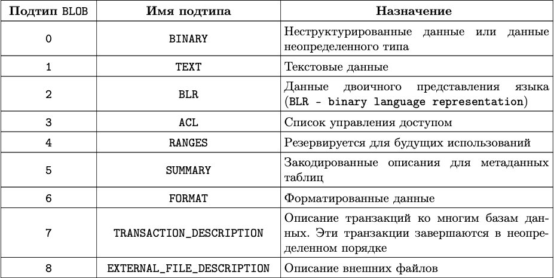

Типы данных
===========

``Тип данных`` определяет множество значений, которые может содержать
столбец таблицы, переменная или параметр хранимой процедуры или
триггера. Тип данных определяет также допу- стимые для соответствующего
столбца (переменной, параметра) операции.

Рассмотрим типы данных, используемые в СУБД Ред База Данных.
Перечисленные типы данных могут применяться при описании доменов и при
описании характеристик столбцов таблиц базы данных, входных и выходных
параметров хранимых процедур, внутренних переменных хранимых процедур и
триггеров.

Числовые типы данных
--------------------

В SQL существует достаточно большое количество числовых типов данных. В
эту категорию типов данных входят числа с фиксированной точкой
(целочисленные и дробные) и числа с плавающей точкой.

Целочисленные:
~~~~~~~~~~~~~~

-  ``SMALLINT`` - 2 байта. Целые числа от ``–32 768`` до ``+32 767``
-  ``INTEGER`` - 4 байта. Целые числа от ``−2^31`` до ``+2^31−1``
-  ``BIGINT`` - 8 байт. Целые числа от ``−2^63`` до ``+2^63−1``

Дробные:
~~~~~~~~

-  ``DECIMAL(n, m)`` - 2, 4 или 8 байт.

   -  n (от 1 до 18) - общее кол-во знаков, включая дробные, - m (от 0
      до 18) - количество знаков после десятичной точки

-  ``NUMERIC(n, m)`` - аналогичен DECIMAL.

Числа с плавающей точкой:
~~~~~~~~~~~~~~~~~~~~~~~~~

-  ``FLOAT`` - 4 байта. Числа от ``1.175×10^−38`` до ``3.402×10^38``
-  ``DOUBLE PRECISION`` - 8 байт. Числа от ``2.225×10^−308`` до
   ``1.179×10^308``

Числа с фиксированной точкой (целые и дробные) иногда называют также
точными числами (exact numeric).

Для числовых типов данных определены четыре арифметические операции —
сложение, вычитание, умножение и деление.

Следует заметить, что в диалекте 3 базы данных типы данных ``DECIMAL`` и
``NUMERIC`` хранятся и используются совершенно одинаковым образом.
Способ хранения таких данных зависит от разрядности — общего количества
знаков, отводимых под число типа ``DECIMAL`` или ``NUMERIC``. При
разрядности до 4 знаков число хранится как ``SMALLINT``. От 5 до 9 — как
``INTEGER``. От ``10`` до ``18`` — как ``BIGINT``.

Операции сложения и вычитания для всех числовых типов данных выполняются
обычным образом.

Следует только быть особенно внимательными при выполнении операций
умножения и деления чисел с фиксированной точкой (``SMALLINT``,
``INTEGER``, ``BIGINT``, ``DECIMAL`` и ``NUMERIC``). В этих операциях
результат будет иметь количество дробных знаков, равное сумме дробных
знаков обоих операндов.

Классический пример — деление двух целых чисел. Результатом операции
``1/3`` будет ``0``, потому что сумма дробных знаков операндов равна
нулю, а целая часть в результате выполнения операции деления будет равна
нулю. Результат является целочисленным. Чтобы получить значение с
заданной точностью, необходимо у одного или у обоих операндов явно
указать нужное количество нулевых дробных знаков.

Например, операция ``1.00 / 3`` вернет уже более верное число —
``0.33``. Тот же результат можно получить, если записать операцию
деления в следующем виде: ``1.0 / 3.0``

Для получения числа с нужной точностью можно также выполнить явное
преобразование с использованием функции CAST одного или обоих операндов.

Например: ``CAST(1 AS DECIMAL(3,2)) / 3``

Результатом будет то же число ``0.33``.

Для чисел с плавающей точкой все операции выполняются таким же образом,
как принято во всех языках программирования. Следует помнить, что эти
типы данных имеют конкретное количество значащих цифр (15 для DOUBLE
PRECISION и 7 для FLOAT). Если, например, к очень большому числу с
плавающей точкой прибавить очень маленькое число (или вычесть из него
такое число), то результат не будет отличаться от первого, большего,
числа.

В следующем выражении

``1.23E+20 - 1.23E-24``

где первый операнд является очень большим по величине числом, а второй —
очень маленьким, результатом будет это же первое, большее, число
``1.23E+20``.

Для числовых типов данных могут использоваться следующие полезные
агрегатные функции, определенные в SQL — ``MIN``, ``MAX``, ``SUM``,
``AVG`` и др. Функции возвращают единственное значение, используя
множество входных данных, получаемых, как правило, из оператора
``SELECT``. Есть также агрегатная функция подсчета количества значений
``COUNT``, возвращающая целое число, но не связанная в качестве входных
параметров с числовым типом данных.

Строковые типы данных
---------------------

К строковым (символьным) типам данных относятся следующие типы данных,
определенные в SQL Ред Базы Данных:

-  ``CHAR`` (``CHARACTER``),
-  ``VARCHAR`` (``VARYING CHARACTER``),
-  ``NCHAR`` (``NATIONAL CHARACTER``),
-  ``NCHAR VARYING`` (``NATIONAL CHARACTER VARYING``).

Строковые константы заключаются в апострофы. Если в строковой константе
присутствует символ апостроф, то он должен быть представлен двумя подряд
идущими апострофами.

Для строковых типов данных определена только одна операция конкатенации
— соединения двух строк в одну. Для обозначения этой операции
применяются два подряд идущих символа вертикальной черты ``||``.

Это простая операция, ее результатом является строка, которая
представляет собой соединение двух операндов, двух строк. Операция
всегда возвращает тип данных ``CHAR`` (а не ``VARCHAR``), независимо от
того, какой именно строковый тип данных имеют исходные строки. Это
означает, что в результате конкатенации сохраняются конечные пробелы.
Размер (количество символов) результирующей строки равен сумме размеров
исходных строк конкатенации. Например, можно записать следующую
операцию:

``'Руководство ' || 'по SQL '``

Результатом будет одна строка: «\ ``Руководство по SQL``\ ».

Для строковых и ряда других типов данных применимо множество встроенных
функций SQL.

Функция TRIM
~~~~~~~~~~~~

Встроенная функция TRIM удаляет начальные и/или конечные указанные
символы (по умолчанию пробелы) в исходной строке, передаваемой функции в
виде входного параметра. Ее синтаксис:

``TRIM( [ [ LEADING | TRAILING | BOTH ] [удаляемые символы] FROM ] <строка>)``

Первый параметр — спецификация удаления — определяет, из какой части
строки (начальной и/или конечной) будут удаляться указанные символы.
Параметр может иметь следующие значения:

-  LEADING — символы удаляются из начальной части строки.
-  TRAILING — удаляются конечные символы строки.
-  BOTH (значение по умолчанию) — символы одновременно удаляются как из
   начальной, так и из конечной части стоки.

Удаляемые символы — строка, содержащая произвольное количество символов.
Эта строка заключается в апострофы. Если параметр не указан,
предполагаются пробелы. Строковым данным в функции может быть строковый
столбец, домен, которому был задан строковый тип данных, строковый
литерал, заключенный в апострофы, входной или выходной параметр хранимой
процедуры, локальная переменная строкового типа данных.

Функция поддерживает тип BLOB. Если строковое данное имеет тип BLOB, то
и результат будет иметь тип BLOB. В противном случае результат будет
иметь тип VARCHAR(n), где n является длиной строкового данного.

Например, результатом выполнения команды

``select TRIM (' Руководство ' || 'по SQL ') from rdb$database;``

Будет строка «Руководство по SQL». Здесь по умолчанию убираются символы
пробелов.

В результате выполнения следующей функции будут удалены только начальные
символы «звездочка».

``TRIM (LEADING '*' FROM '***********Руководство ' || 'по SQL*******')``

Функция вернет строку «Руководство по SQL*******».

В результате выполнения следующей функции будут удалены только конечные
символы «звездочка».

``TRIM (TRAILING '*' FROM '***********Руководство ' || 'по SQL*******')``

Функция вернет строку «***********Руководство по SQL».

Чтобы удалить как начальные, так и конечные символы «звездочка» из
строки, нужно выполнить функцию:

``TRIM (BOTH '*' FROM '***********Руководство ' || 'по SQL*******')``

Ключевое слово BOTH можно не задавать. В этом случае удаляются указанные
символы как с начала, так и с конца строки.

Функция SUBSTRING
~~~~~~~~~~~~~~~~~

Встроенная функция SUBSTRING возвращает подстроку исходной строки.
Синтаксис
функции\ ``SUBSTRING (<строка> FROM <начало> [ FOR <длина> ])``

Начало - номер символа (с единицы), начиная с которого выделяется
подстрока. Длина - количество выделяемых символов. Поддерживает BLOB.
Тогда результат BLOB, иначе VARCHAR.

Поддерживается также вариант с регулярными выражениями

``SUBSTRING (<строка> SIMILAR <шаблон> ESCAPE <символ>)``

Шаблон - регулярное выражение
``<шаблон> ::= <шаблон: R1><символ экр-ия>"<шаблон: R2><символ экр-ия>"<шаблон: R3>``

Возвращает часть строки, соответствующую шаблону, либо NULL. Здесь —
исходное строковое данное (строковый домен, столбец таблицы, входной или
выходной параметр хранимой процедуры, строковый литерал, заключенный в
апострофы, локальная переменная, используемая в хранимой процедуре или
триггере).

— номер позиции в строке, начиная с которой выделяется подстрока.
Нумерация символов в строке начинается с единицы. Если начальная позиция
подстроки превышает количество символов в строковом данном, то будет
выделена пустая подстрока — строка, содержащая ноль символов.

— количество символов, которые выбираются в результирующую строку.
Должно быть положительным числом. Если задать количество символов,
которое выходит за границы исходной строки, то результат будет усечен до
размера, соответствующего положению последнего символа исходной строки.
При этом не будет выдано никаких диагностических сообщений. Если
ключевое слово FOR не указано, то в подстроку помещаются все оставшиеся
до конца исходной строки символы.

Функция полностью поддерживает двоичные и текстовые BLOB любой длины и с
любым набором символов. Если строковое данное имеет тип BLOB, то и
результат будет иметь тип BLOB. Для любых других типов результатом будет
тип VARCHAR(n). Для строкового данного, не являющегося BLOB, длина
результата функции всегда будет равна длине исходной строки,независимо
от значений других параметров. Функция SUBSTRING с регулярным выражением
возвращает часть строки соответствующей шаблону в предложении SIMILAR.
Если соответствия не найдено, то возвращается NULL.

Если любая из частей регулярного выражения (R1, R2 или R3) не является
пустой строкой и не соответствует формату , будет возбуждено исключение.

Возвращаемое значение соответствует части R2 регулярного выражения. Для
этого значения истинно выражение:

SIMILAR TO R1 \|\| R2 \|\| R3 ESCAPE

Если любой из входных параметров имеет значение NULL, то и результат
тоже будет иметь значение NULL.

Примеры.

Выполнение функции ``SUBSTRING ('Руководство ' FROM 5 FOR 3)`` даст
строку «вод».

Следующая функция ``SUBSTRING ('Руководство ' FROM 5 FOR 100)`` вернет
строку «водство». Здесь происходит усечение результата без выдачи
диагностических сообщений.

Выполнение функции ``SUBSTRING ('123456' FROM 8 FOR 10)`` вернет пустую
строку, не содержащую никаких символов.

Выполнение функции
``SUBSTRING(’abcdefg’ SIMILAR ’_#"%#"_’ ESCAPE ’#’ )`` вернет строку
«bcdef».

Функции LEFT и RIGHT
~~~~~~~~~~~~~~~~~~~~

Упрощенным вариантом функции ``SUBSTRING`` являются функции ``LEFT``,
которая возвращает указанные первые символы строки, и ``RIGHT``,
возвращающая последние символы строки. Синтаксис функций LEFT и RIGHT:

``LEFT (<строка>, <длина подстроки>)``

``RIGHT (<строка>, <длина подстроки>)``

Функции поддерживают текстовые BLOB любой длины и с любыми наборами
символов. Если строка имеет тип BLOB, то и результат будет иметь тип
BLOB. Для любых других типов результатом будет тип VARCHAR(n), где n
является длиной исходной строки. Если числовой параметр превысит длину
текста, результатом будет исходный текст.

Функции UPPER и LOWER
~~~~~~~~~~~~~~~~~~~~~

Функция ``UPPER`` переводит все буквы исходной строки в верхний регистр.
Функция правильно работает не только с латинскими буквами, но и с
буквами кириллицы. Синтаксис функции

``UPPER (<строка>)``

Выполнение функции ``UPPER ('россия')`` вернет строку «РОССИЯ».

Функция ``LOWER`` переводит все буквы исходной строки в нижний регистр.
Функция правильно работает с латинскими буквами и с буквами кириллицы.
Синтаксис функции:

``LOWER (<строка>)``

Выполнение функции ``LOWER ('РОССИЯ')`` вернет строку «россия».

Точный результат зависит от набора символов входной строки. Например,
для наборов символов NONE и ASCII только ASCII символы переводятся в
верхний(нижний) регистр; для OCTETS — вся входная строка возвращается
без изменений. Функции поддерживают тип данных BLOB.

Функции CHARACTER_LENGTH, OCTET_LENGTH и BIT_LENGTH
~~~~~~~~~~~~~~~~~~~~~~~~~~~~~~~~~~~~~~~~~~~~~~~~~~~

Три функции позволяют определить размер строк.

Функция ``CHARACTER_LENGTH`` (сокращенное название ``CHAR_LENGTH``)
возвращает количество символов, занимаемых входным параметром функции
(константа, контекстная переменная, столбец таблицы). Для строки функция
возвращает именно количество символов, а не байтов, отводимых под
исходную строку. Если функция применяется к столбцу, в котором для
каждого символа используется более одного байта, то количество байтов
этого столбца (функция ``OCTET_LENGTH``) будет больше, чем количество
символов.

Синтаксис функции ``CHARACTER_LENGTH``:

``CHARACTER_LENGTH(<строка>)``

``CHAR_LENGTH(<строка>)``

Функция ``OCTET_LENGTH`` возвращает количество байтов, занимаемых
входным параметром функции. Не для всех наборов символов возвращаемое
значение равняется значению ``CHARACTER_LENGTH``. Синтаксис функции:

``OCTET_LENGTH(<строка>)``

Функция ``BIT_LENGTH`` возвращает количество битов во входном параметре.
Возвращаемое значение будет в точности равно ``OCTET_LENGTH ∗ 8``.
Синтаксис функции:

``BIT_LENGTH(<строка>)``

Поскольку для строк определена операция сравнения, к строковым данным
могут также применяться и агрегатные функции ``MIN`` и ``MAX``. Эти
функции будут отыскивать, соответственно, минимальное и максимальное
значение указанных столбцов выбранных строк таблицы, представления или
хранимой процедуры выбора.

Сравнение строковых данных осуществляется в соответствии с используемым
для столбца набором символов (``CHARACTER SET``) и порядком сортировки
(``COLLATION ORDER``).

Существуют другие строковые функции.

-  ``POSITION`` отыскивает позицию подстроки в строке.
-  ``REVERSE`` переписывает символы строки в обратном порядке.
-  ``REPLACE`` отыскивает в строке заданную подстроку и заменяет ее на
   другую.
-  ``LPAD`` добавляет к строке слева указанную подстроку.
-  ``RPAD`` добавляет к строке справа указанную подстроку.
-  ``OVERLAY`` заменяет указанное количество символов на заданное
   значение.
-  ``HASH`` возвращает хэш-значение входной строки.
-  ``ASCII_CHAR`` возвращает ASCII символ соответствующий номеру,
   переданному в качестве аргумента.
-  ``ASCII_VAL`` возвращает ASCII код символа, переданного в качестве
   аргумента.

Логический тип данных
---------------------

Ред База Данных предоставляет стандартный SQL тип BOOLEAN. Значений у
этого типа может быть несколько:

-  TRUE (истина)
-  FALSE (ложь)
-  UNKNOWN (неизвестно)

представляется SQL значением NULL. Спецификация не делает различия между
значением NULL этого типа и значением истинности UNKNOWN, которое
является результатом SQL предиката, поискового условия или выражения
логического типа. Эти значения взаимозаменяемы и обозначают одно и то
же.

Значения типа BOOLEAN могут быть проверены в неявных значениях
истинности. Например, ``field1 OR field2`` или ``NOT field1`` являются
допустимыми выражениями.

Предикаты могут использовать оператор ``IS [NOT]`` для проверки
соответствия. Например, field1 IS FALSE или field1 IS NOT TRUE.

Тип данных BOOLEAN не преобразуется неявно ни к одному типу, но возможно
явное преобразование к строке с помощью функции CAST.

Пример. Приведем пример использования типа BOOLEAN:

::

   create table CHECKBOOL (ID integer, BOOLVAL boolean);
   insert into CHECKBOOL values (1, 1 != 4);
   insert into CHECKBOOL values (2, FALSE);
   insert into CHECKBOOL values (3, NULL - 1);

   SELECT * FROM CHECKBOOL;
   ID          BOOLVAL 
   ============ =======
   1               <true>
   2               <false>
   3               <null>

   SELECT * FROM CHECKBOOL WHERE BOOLVAL = TRUE;
   ID              BOOLVAL 
   ============ =======
   1               <true>

   SELECT * FROM CHECKBOOL WHERE NOT BOOLVAL;
   ID              BOOLVAL 
   ============ ======= 
   2               <false>

   SELECT * FROM CHECKBOOL WHERE BOOLVAL IS UNKNOWN;
   ID              BOOLVAL 
   ============ =======
   3               <null>

Тип данных даты и времени
-------------------------

Существует три типа данных для представления даты и времени — ``DATE``,
``TIME`` и ``TIMESTAMP``, позволяющие хранить, соответственно, дату,
время и объединение даты и времени.

Тип данных DATE
~~~~~~~~~~~~~~~

Этот тип данных позволяет хранить только дату в диапазоне от 1 января 1
года до 31 декабря 9999 года.

Для литералов, представляющих дату, в SQL существует много форматов. При
описании синтаксиса для формата типа DATE для указания номера дня в
месяце используются символы «dd» (число от 1 до 31), для месяца в году —
«mm» (число от 1 до 12), для номера года — «yyyy» (число от 1 до 9999).
Для номера дня и номера месяца ведущий ноль можно не указывать. Год
может быть задан и числом с меньшей, чем четыре, значимостью. Вот
основные форматы даты, используемые в SQL Ред База Данных:

::

   dd.mm.yyyy 
   mm-dd-yyyy 
   mm/dd/yyyy 
   yyyy-mm-dd 
   yyyy/mm/dd 
   yyyy.mm.dd 
   dd-MON-yyyy

MON — трехсимвольное сокращенное название месяца (английское). Может
принимать значения (в любом регистре): ``jan``, ``feb``, ``mar``,
``apr``, ``may``, ``jun``, ``jul``, ``aug``, ``sep``, ``oct``, ``nov``,
``dec`` – месяцы с января по декабрь.

Например, ту же дату 14 июля 2007 года можно записать в следующем виде:
``'14.07.2007'``, ``'14-JUL-2007'``, ``'07-12-2007'``, ``'07/12/2007'``
и т.д.

На сегодняшний день все числа года от 0 до 50, указывают на годы,
которые начинаются с 2000. Большие: 51 и выше — годы с 1900. Для
устранения неопределенности и возможных изменений в будущих версиях
системы можно рекомендовать задание полного номера года: например, 14
июля 2007 года следует записать в виде ``'14.07.2007'``, а 14 июля 1907
года — в виде ``'14.07.1907'``.

Чтобы задать более ранние даты, следует всегда в номере года указывать
все ведущие нули. Например, чтобы указать 1 января 1 года, нужно
записать: ``'1.1.0001'`` или ``'01.01.0001'``

Тип данных TIME
~~~~~~~~~~~~~~~

Тип данных время (``TIME``) позволяет хранить только время с точностью
до десятитысячной доли секунды (до 100 микросекунд). Он задается
литералом в одном из вариантов:

::

   'hh:mm:ss.nnnn'
   'hh.mm.ss.nnnn'

Здесь:

-  hh — часы: число от 0 до 23,
-  mm — минуты: число от 0 до 59,
-  ss — секунды: число от 0 до 59,
-  nnnn — десятитысячные доли секунды, число от 0000 до 9999.

Для часов, минут и секунд ведущий ноль можно не указывать.

Например, время 23 часа, 16 минут и 32 секунды с 98 десятитысячными
долями секунды нужно записать в виде: ``'23:16:32.0098'`` или
``'23.16.32.0098'``

Тип данных TIMESTAMP
~~~~~~~~~~~~~~~~~~~~

Тип данных дата и время (``TIMESTAMP``) представляет собой соединение
даты и времени, которые в литералах просто разделяются любым количеством
пробелов.

Например, для задания 12 часов 30 минут 14 июня 2007 года можно
записать: ``'14.07.2007 12:30'``

Арифметические операции для типов данных даты и времени
~~~~~~~~~~~~~~~~~~~~~~~~~~~~~~~~~~~~~~~~~~~~~~~~~~~~~~~

Для типов данных даты (``DATE``) и времени (``TIME``) определены
операции сложения и вычитания.

Операция сложения для типа ``DATE`` и целого числа дает дату,
увеличенную на заданное количество дней. Вычитание из типа данных
``DATE`` целого числа возвращает дату, уменьшенную на указанное
количество дней. В операции можно указать и дробное число. К ошибке это
не приводит, происходит правильное округление числа до ближайшего
целого.

Например, следующая операция дает завтрашнюю дату: ``CURRENT_DATE + 1``

Чтобы получить вчерашнюю дату, нужно записать: ``CURRENT_DATE - 1``

Вчерашнюю дату можно получить, также записав: ``CURRENT_DATE – 1.003``

Вычитание двух дат дает количество дней в интервале. Например, чтобы
узнать, сколько дней осталось до Нового Года 2030, нужно записать:
``CAST('31.12.2029' AS DATE) - CURRENT_DATE``

Сложение «TIME + число» дает указанное время, увеличенное на заданное
число секунд, включая десятитысячные доли секунды. Здесь в операции
можно использовать дробное число.

Соответственно, вычитание «TIME − число» дает время, уменьшенное на
заданное число секунд, включая десятитысячные доли секунды.

Вычитание двух переменных типа TIME дает интервал времени в секундах
(включая десятитысячные доли секунды).

   Для типа данных TIMESTAMP ни одна из перечисленных операций
   недопустима.

Функции для типов даты и времени
--------------------------------

Функция EXTRACT
~~~~~~~~~~~~~~~

Для выделения элементов даты и времени из типов данных ``DATE``,
``TIME`` и ``TIMESTAMP`` может использоваться встроенная функция
``EXTRACT``. Её синтаксис:

``EXTRACT (<выделяемый элемент> FROM <параметр>)``

Параметром данным может быть столбец, домен (ключевое слово ``VALUE``),
параметр или внутренняя переменная хранимой процедуры или триггера.

Выделяемый элемент:

-  YEAR — год: функция вернет целое число от 1 до 9999, ведущие нули
   отбрасываются,
-  MONTH — месяц: вернет целое число от 1 до 12, ведущий ноль
   отбрасывается,
-  DAY — день месяца: целое число от 1 до 31, ведущий ноль
   отбрасывается,
-  HOUR — функция возвращает часы: целое число от 0 до 23,
-  MINUTE — возвращаются минуты: целое число от 0 до 59,
-  SECOND — секунды, включая десятитысячные доли секунды,
-  MILLISECOND – возвращаются миллисекунды,
-  WEEK — номер недели в году: целое число от 1 до 53,
-  WEEKDAY — номер дня в неделе; 0 — воскресенье, 6 — суббота,
-  YEARDAY — номер дня в году: число от 0 до 365. Первый день в году
   имеет номер 0.

Выделять часы, минуты и секунды можно лишь в типах данных, содержащих
время: ``TIME`` и ``TIMESTAMP``. Аналогично, выделение элементов даты
возможно только для тех типов данных, которые содержат дату: ``DATE`` и
``TIMESTAMP``.

В следующем операторе из переменной ``DATE_C`` типа ``DATE`` выделяются
день, месяц и год. Полученные данные при помощи операции конкатенации
приводятся к виду, принятому в нашей стране:

::

   EXTRACT (DAY FROM DATE_C) || '.' || 
   EXTRACT (MONTH FROM DATE_C) || '.' || EXTRACT (YEAR FROM DATE_C)

Для типов данных ``DATE`` и ``TIME`` допустимы также и функции ``MIN`` и
``MAX``, возвращающие, соответственно, минимальное или максимальное
значение в группе столбцов из выбранных оператором ``SELECT`` строк.

Функция DATEADD
~~~~~~~~~~~~~~~

Функция ``DATEADD`` позволяет изменить значение заданной даты и/или
времени. Возвращает значение типа данных ``DATE``, ``TIME`` или
``TIMESTAMP`` в зависимости от типа данных входного параметра.
Возвращаемое значение параметра увеличивается (уменьшается, если задано
отрицательное значение параметра «целое число») на соответствующее
количество секунд (миллисекунд, минут, часов, дней, месяцев, лет),
заданных параметром «целое число». У функции есть два формата:

``DATEADD(<целое число> <элемент даты/времени> TO <входной параметр>)``
``DATEADD(<элемент даты/времени>, <целое число>, <входной параметр>)``

Элемент даты/времени — это: ``YEAR``, ``MONTH``, ``WEEK``, ``DAY``,
``WEEKDAY``, ``YEARDAY``, ``HOUR``, ``MINUTE``, ``SECOND``,
``MILLISECOND``.

С типом данных, содержащим только время, не могут использоваться
элементы, относящиеся к дате. С типом данных ``DATE`` не могут
использоваться элементы времени. Для типа данных ``TIMESTAMP`` допустимы
любые варианты.

Целое число в функции должно находиться в диапазоне от
``–2,147,483,648`` до ``+2,147,483,647``. Дробные знаки в числе
отбрасываются без округления.

Например, чтобы получить завтрашнюю дату, нужно вызвать следующую
функцию: ``DATEADD(DAY, 1, CURRENT_DATE)``

Упражнение:

1. Получить вчера
2. Получить дату через месяц
3. Получить дату через год
4. Получить время через час
5. Получить время минуту назад

Функция DATEDIFF
~~~~~~~~~~~~~~~~

Функция ``DATEDIFF`` возвращает целое число, задающее интервал в
соответствии с указанным элементом между двумя значениями типа данных
``DATE``, ``TIME`` или ``TIMESTAMP``. У функции есть два формата:

``DATEDIFF(<элемент даты/времени> FROM <параметр 1> TO <параметр 2>)``
``DATEDIFF(<элемент даты/времени>, <параметр 1>, <параметр 2>)``

Элемент даты/времени — это ``YEAR``, ``MONTH``, ``WEEK``, ``DAY``,
``WEEKDAY``, ``YEARDAY``, ``HOUR``, ``MINUTE``, ``SECOND``,
``MILLISECOND``.

С типом данных, содержащим только время, не могут использоваться
элементы, относящиеся к дате. С типом данных ``DATE`` не могут
использоваться элементы времени. Для типа данных ``TIMESTAMP`` допустимы
любые варианты.

Функция возвращает количество интервалов, заданных элементом
даты/времени (лет, месяцев, дней, часов, минут, секунд или миллисекунд)
между двумя входными параметрами. Возвращается число со знаком: из
второго параметра производится соответствующее вычитание элемента
первого параметра.

Дата и время имеет естественную иерархическую структуру: год, месяц,
день, час, минута, секунда, миллисекунда. При вычислении разности
элементов одного уровня учитываются значения лишь этого или более
высокого уровня. Элементы нижележащих уровней не учитываются.

Например.

Чтобы определить, сколько лет осталось до 2050 года, нужно выполнить
функцию:

``DATEDIFF (YEAR, CURRENT_DATE, CAST('01.01.2050' AS DATE))``

Чтобы определить, сколько дней осталось до 2050 года, нужно выполнить
функцию:

``DATEDIFF (MONTH, CURRENT_DATE, CAST('01.01.2050' AS DATE))``

Тип данных BLOB
---------------

Тип данных ``BLOB`` называется большим двоичным объектом (Binary Large
OBject). Этот тип данных позволяет хранить любые большие по объему
данные — форматированные тексты, графику, звуки, видео.

Синтаксис объявления типа ``BLOB``

::

   BLOB [SUB_TYPE <имя подтипа>]
       [SEGMENT SIZE <размер сегмента>] 
       [CHARACTER SET <набор символов>]

Также можно использовать сокращенный синтаксис:

::

   BLOB (<размер сегмента>)
   BLOB (<размер сегмента>, <имя подтипа>)
   BLOB (, <имя подтипа>)

Поля ``BLOB`` не хранятся непосредственно в самой записи вместе с
другими данными строки. Запись содержит только ссылку (идентификатор,
указатель) на страницу базы данных, где располагаются данные BLOB. Тип
данных ``BLOB`` характеризуется размером сегмента, в котором размещаются
данные. Размер сегмента задает в байтах размер полей в базе данных,
которые будут использованы для хранения данных типа ``BLOB``. По
умолчанию принимается ``80``.

Максимальный размер сегмента не может превышать ``64Кб – 1``, то есть
числа ``65535``. За одно обращение к базе данных система всегда
считывает один сегмент. Если в поле ``BLOB`` хранятся данные, занимающие
менее ``32765`` байтов, то хранение и работа с этим полем осуществляется
так же, как и с полем, имеющим тип данных ``VARCHAR``.

Объем данных, которые могут храниться в этом типе данных, зависит от
размера страницы базы данных:

-  При размере страницы ``4K`` байтов размер ``BLOB`` не может превышать
   ``4ГБ``,
-  При размере страницы ``8K`` байтов — ``32ГБ``,
-  При размере страницы ``16K`` байтов — ``256ГБ``,
-  При размере страницы ``32K`` байтов — ``2TB``.

При объявлении столбца или домена типа ``BLOB`` можно указать его подтип
(предложение ``SUB_TYPE``), а также размер сегмента, используемый при
хранении данных (предложение ``SEGMENT SIZE``). Значение подтипа может
быть целым числом в диапазоне от ``–32768`` до ``+32767``.

Подтипы (положительные числа или 0) могут использоваться в случае, когда
в базе данных описаны стандартные BLOB-фильтры. Фильтры — это программы,
которые выполняют преобразования между данными ``BLOB`` разных подтипов
на серверной и клиентской стороне. Такие преобразования связаны, как
правило, с упаковкой и, соответственно, распаковкой данных.

В Ред База Данных существуют семь заранее предопределенных подтипов. Их
не следует использовать для каких-то своих внутренних целей.

Предопределенные подтипы BLOB-полей.

|image0|

Для пользовательских подтипов рекомендуется выбирать только
отрицательные числа, поскольку положительные могут использоваться
системой, в том числе и при дальнейших расширениях. На клиентских
программах лежит ответственность за то, что в поля ``BLOB`` заданного
подтипа записываются данные соответствующего вида.

