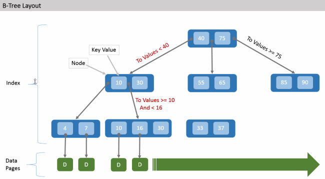

# Индексы

## Понятие индекса и его создание

**Индекс** - это объект БД, содержащий упорядоченные значения указанных
столбцов таблицы и ссылки на физическое размещение записи с данными
значениями.

Индекс позволяет ускорить поиск данных в таблице и упорядочивание
данных. Обычно пользователи или администраторы БД сами создают
необходимые для этого индексы с помощью оператора `CREATE INDEX`.

Кроме того, для обеспечения ограничений целостности --- `PRIMARY KEY`,
`FOREIGN KEY`, `UNIQUE`, СУБД может создавать индексы автоматически.

Синтаксис:

``` sql
CREATE [UNIQUE] [ASC[ENDING] | DESC[ENDING]] INDEX indexname ON tablename
    {(col [, col …]) | COMPUTED BY (<expression>)};
```

indexname - Имя индекса. Может содержать до 31 байта. tablename - Имя
таблицы, для которой строится индекс. col - Столбец таблицы. В качестве
столбцов не могут быть использованы поля типа BLOB, ARRAY и вычисляемые
поля. expression - Выражение, содержащее столбцы таблицы.

Если при создании индекса указано ключевое слово `UNIQUE`, то индекс
гарантирует уникальность значений ключей. Такой индекс называется
уникальным. Уникальный индекс не является ограничением уникальности.
Уникальные индексы не могут содержать дубликаты значений ключей (или
дубликаты комбинаций значений ключей в случае составного,
многоколоночного или многосегментного индекса). Дубликаты значения
`NULL` допускаются в соответствии со стандартом `SQL-99` (в том числе и
в многосегментном индексе).

Все индексы в Firebird/RedDatabase являются однонаправленными. Индекс
может быть построен в восходящем и нисходящем порядке. Ключевые слова
`ASC[ENDING]` и `DESC[ENDING]` используются для указания направленности
индекса. По умолчанию создаётся восходящий `ASC[ENDING]` индекс.
Допускается одновременное определение восходящего и низходящего индекса
на одном и том же столбце или наборе ключей. Убывающий (`DESC[ENDING]`)
индекс может быть полезен при поиске наивысших значений (максимум,
последнее и т.д.)

При создании индекса вместо одного или нескольких столбцов вы также
можете указать одно выражение, используя предложение `COMPUTED BY`.
Такой индекс называется **вычисляемым** или **индексом по выражению**.
Вычисляемые индексы используются в запросах, в которых условие в
предложениях `WHERE`, `ORDER BY` или `GROUP BY` в *точности* совпадает с
выражением в определении индекса. Выражение в вычисляемом индексе может
использовать несколько столбцов таблицы.

Примеры:

Создание индекса

``` sql
CREATE INDEX IDX_UPDATER ON SALARY_HISTORY (UPDATER_ID);
```

Создание индекса с сортировкой ключей по убыванию

``` sql
CREATE DESCENDING INDEX IDX_CHANGE ON SALARY_HISTORY (CHANGE_DATE);
```

Создание многосегментного индекса

``` sql
CREATE INDEX IDX_SALESTAT ON SALES (ORDER_STATUS, PAID);
```

Создание индекса, не допускающего дубликаты значений

``` sql
CREATE UNIQUE INDEX UNQ_COUNTRY_NAME ON COUNTRY (NAME);
```

Создание вычисляемого индекса

``` sql
CREATE INDEX IDX_NAME_UPPER ON PERSONS COMPUTED BY (UPPER (NAME));
```

Такой индекс может быть использован для регистронезависимого поиска.

``` sql
SELECT * FROM PERSONS WHERE UPPER(NAME) STARTING WITH UPPER('Iv');
```

## Устройство индекса

Внутри индекс может быть реализован с помощью различных структур данных,
но часто для этого используется B+-дерево.



## Изменение и удаление индекса

Индекс можно перевести в неативное состояние или снова активировать.

Для этого используется оператор

``` sql
ALTER INDEX indexname {ACTIVE | INACTIVE};
```

При выборе опции `INACTIVE`, индекс переводится из активного в
неактивное состояние. Перевод индекса в неактивное состояние по своему
действию похоже на команду `DROP INDEX` за исключением того, что
определение индекса сохраняется в базе данных. Невозможно перевести в
неактивное состояние индекс участвующий в ограничении.

Активный индекс может быть отключен, только если отсутствуют запросы
использующие этот индекс, иначе будет возвращена ошибка «object in use».

Перевод индекса в неактивное состояние может быть полезен при массовой
вставке, модификации или удалении записей из таблицы, для которой этот
индекс построен.

При выборе альтернативы `ACTIVE` индекс переводится из неактивного
состояния в активное. При переводе индекса из неактивного состояния в
активное индекс перестраивается.

Для удаления индекса используется оператор

``` sql
DROP INDEX indexname;
```

, где indexname - Имя индекса

## Селективность индекса

**Селективность индекса** --- это оценочное количество строк, которые
могут быть выбраны при поиске по каждому значению индекса. Уникальный
индекс имеет наилучшую селективность, поскольку при его использовании
невозможно выбрать более одной строки для каждого значения ключа
индекса.

Селективность вычисляется по формуле: `S = 1/(Records-Duplicates)`.

Актуальность селективности индекса важна для выбора наиболее
оптимального плана выполнения запросов оптимизатором. Пересчёт
селективности индекса может потребоваться после массовой вставки,
модификации или удалении большого количества записей из таблицы,
поскольку она становится неактуальной.

Для пересчета селективности индекса используется оператор

``` sql
SET STATISTICS INDEX indexname;
```

, где indexname - Имя индекса

Пересчёт селективности индекса может быть выполнен под высоко
параллельной нагрузкой без риска его повреждения. Тем не менее, следует
помнить, что при высоком параллелизме рассчитанная статистика может
устареть, как только закончится выполнение оператора `SET STATISTICS`.

## Достоинства и недостатки индексов

Следует понимать что использование индексов влечет накладные расходы на
поддержание внутренних структур данных в актуальном состоянии. Как
правило для сложных выборок индексы необходимы, но частые операции
обновления данных могут выполнятся значительно быстрее если индекса нет
или он неактивен. Это следует помнить при оптимизации работы с БД.
